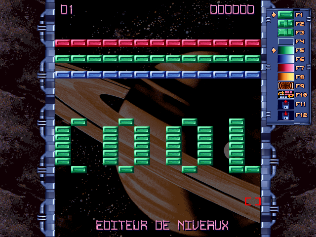

# Brick Blaster Extract Tools


## Description
This repository contains some Python scripts to extract the resources (images, musics, etc) of the game Brick Blaster (Media Pocket 1999 French and Spanish Versions).

This follows the research I did about crashes happening on Windows 7+ and patches I released in the repo [Brick Blaster Patch](https://github.com/david4599/BrickBlaster-Patch). Hidden features and easter eggs I also discovered will be listed here at the end.

All the extracted resources are already available in the [Releases](https://github.com/david4599/BrickBlaster-ExtractTools/releases/latest) section. Look at the [Notes](https://github.com/david4599/BrickBlaster-ExtractTools#notes) section to have more information about the contents of the resources.zip file.

## Dependencies
- Install Python (should be compatible 2.7 - 3.x).
- Install pip packages `kaitaistruct` and `pypiwin32` (make sure to have up-to-date pip and setuptools):

  ```
  python -m pip install --upgrade pip
  python -m pip install setuptools --upgrade
  python -m pip install kaitaistruct pypiwin32
  ```
- Build Undiet (Diet is an old and not used anymore packer for compressing and self-extracting executables and data) from sources located in `.\undiet\src`. The compiled exe must be placed in `.\undiet\bin`. The sources are compatible with Visual Studio 2019 and g++ (at least).
- Install [SoX](https://sourceforge.net/projects/sox/) and add its install folder to your PATH environment variable.

## Usage
First, use the script `ExtractResources.py` to extract the resources from blaster.exe. It will launch the game briefly and try to dump the archive-like header (containing filenames, sizes and offsets) from the memory to the file `blaster_res_header.bin`. The script will parse this binary file and get all the files from blaster.exe.  
If the game can't be launched or the script can't dump the bin file, use [Cheat Engine](https://www.cheatengine.org) or a debugger to manually dump it (RVA should be 0x21AC4 and size is 1060 bytes) and set it as the third command line argument.

Usage example:
```
python ExtractResources.py "C:\blaster\blaster.exe" "C:\blaster\extracted"
python ExtractResources.py "C:\blaster\blaster.exe" "C:\blaster\extracted" "C:\blaster\header_dump.bin"
```

Then, execute the script `UnpackDLZ.py` to unpack and replace all the files from a folder (not subfolders) that were compressed with Diet packer.  
This script uses Undiet, a (really rare) C++ open-source program, included in the [tombexcavator](https://code.google.com/archive/p/tombexcavator/) (GNU GPLv3) project, that can unpack these files. The source code was slightly modified to suit the needs of this project.

Usage example:
```
python UnpackDLZ.py "C:\blaster\extracted"
```

Finally, the script `ConvertIFF.py` can convert IFF sound files to the WAV format. The WAV samples are resampled from 8363Hz (IFF 8svx format) to 12963Hz to get the original speed/tone (to the ear).

Usage example:
```
python ConvertIFF.py "C:\blaster\extracted" "C:\blaster\extracted\wav"
```

## Hidden features
- A level editor used by the development team to create the levels has been discovered.

  

  To enable it, unpack the file blaster.cfg with the `UnpackDLZ.py` script (included in the zip file). Change the 0 to 1 in the `Editor_Flag` line. Start the game, go to a level a press 'E'.

  The functions of this editor are:
   - Left click or space to add a brick
   - Right click to delete a brick
   - F1 - F4 to change brick type
   - F5 - F8 to change brick color
   - F9 to add a teleporter brick
   - F10 seems to be used to switch between current level design and previous one in editor mode only (maybe to have an idea of the look when creating the levels).
   - F11 to reload the saved level from the drive
   - F12 to save the current level (warning: it will replace the original files, backup the `blaster.lv*` files before pressing F12)
   
  Too bad it wasn't enabled by default...

- By having the editor flag enabled in the config file, press 'D' while being inside a level to trigger the Demo mode of this level.  
In the same way, press 'T' to enable the Test mode which activates the player bot. This endless mode could have been a great screensaver btw.
- The unpacked file blaster.cfg also allows to modify the game parameters like the numbers of lives at the beginning of a game, the frequency of ball speed increase, text labels and many others.
- An unused level file `blaster.lv2` is located in the install folder. Rename it `blaster.lv1` (backup the original `blaster.lv1` file) and start the game. The Arcade mode has now a slighly different level design.

## Easter eggs
- In the ending song called RAIN.MOD, track 3 (36th second), the sentence ["Three billion human lives ended on August 29, 1997"](https://youtu.be/DHKxoARmjLU?t=50) from the movie Terminator 2: Judgment Day was inserted.
- When loading CREDIT.MOD and LODE.MOD with OpenMPT, in the samples names section (Comments tab), there are some funny sentences:
  
  CREDIT.MOD:
  ```
  ----------------------
  (c) Rez / Eclipse 1995
  ----------------------
  
   It's a 2 day tune !!
  
  Why the coders always
  decide to make a demo
  2 week before a party
          -???-
  
  ----------------------
  sorry 4 my bad english
  ----------------------
  
   Hello 2 all da french
   group...
  ```
  LODE.MOD:
  ```
  ----------------------
  (c) Rez / Eclipse 1996
  ----------------------
  
   ...all samples by me
    except drums sampled
    by Maf (thanks man!)
   
    Especially made for
        the TexMex's
       predator named
      > Hacker Croll <
            -!!-
   
  ```

## Notes
- Some resource formats can't be readable without any third party software. That's why the resource.zip file contains the original files but also the converted mod musics to mp3 and iff sounds to wav. The unpacked config files are also included.
- The FLC format of blaster.flc and intro.flc is a video format without sound that can be read by VLC player.  
  Sadly, blaster.flc seems to be not well decoded by the player but this ending part has been screen recorded to the files "Brick Blaster Ending.mp4" (with music) and "Brick Blaster Ending (Raw).mp4" (Original 450x180 resolution without music) and available in the resources.zip file.
- IFF sound files can be read and exported with the music tracker software [Fasttracker II clone](https://16-bits.org/ft2.php)
- Original game musics were made in the [MOD format](https://en.wikipedia.org/wiki/Module_file). They can be read with the music tracker software [OpenMPT](https://openmpt.org/).  
  Some audio effects were applied directly in game meaning that the musics are a little bit different when they are played with default's OpenMPT settings.  
  To have the (almost) exact same sound, go to View tab -> Setup -> Mixer tab and set the "Resampling Filter" option to "No interpolation". Also, set the "Stereo Separation" to 200%. Then restart OpenMPT.
- The files packed with Diet can be replaced by the unpacked ones without breaking anything. The game can handle them, the unpack function is just ignored like the other files not packed originally.
- The game was launched in 1999 and can't be found easily without having the original CD-ROM. I assume it can be considered as an abandonware today and can be distributed freely so I share it here though an [ISO file](https://www.dropbox.com/s/91b3xgbr1c1e86v/Brick%20Blaster.iso?dl=1).

#
david4599 - 2021